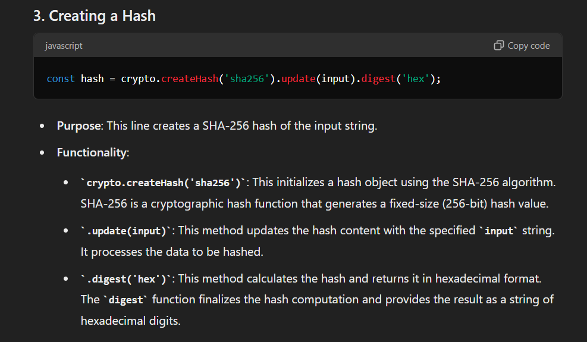

# Contain All the Code Snippet Discussed in the Week 1 Lecture

- Explanation of the Hashing Code
  
- The logic for all the three assignment are same only the initial string is changing for which we need to find the nonce.
